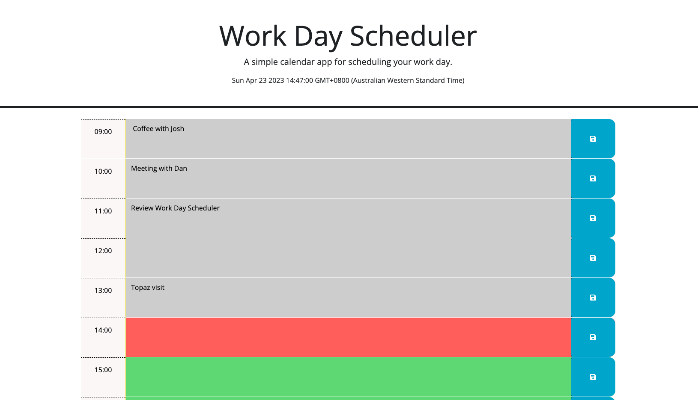

# 05 Third-Party APIs: Work Day Scheduler

Deployed URL: https://peterwonghg.github.io/C05-3rdPartyAPI/

GitHUb URL: https://github.com/peterwonghg/C05-3rdPartyAPI.git


## Your Task

Create a simple calendar application that allows a user to save events for each hour of the day by modifying starter code. This app will run in the browser and feature dynamically updated HTML and CSS powered by jQuery.

## User Story

```md
AS AN employee with a busy schedule
I WANT to add important events to a daily planner
SO THAT I can manage my time effectively
```

## Acceptance Criteria

```md
GIVEN I am using a daily planner to create a schedule
WHEN I open the planner
THEN the current day is displayed at the top of the calendar
WHEN I scroll down
THEN I am presented with timeblocks for standard business hours
WHEN I view the timeblocks for that day
THEN each timeblock is color coded to indicate whether it is in the past, present, or future
WHEN I click into a timeblock
THEN I can enter an event
WHEN I click the save button for that timeblock
THEN the text for that event is saved in local storage
WHEN I refresh the page
THEN the saved events persist
```


## blockColour Function: Changes the colour of the hour block based on time
```
WHEN Time has past
THEN Time Block background turns Grey to represent the past
WHEN Time is the present
THEN Time Block background turns Red to represent the present hour
WHEN Time is going to be the future
THEN Time Block background turns Green to represent the future
```


## Time Element display
Used jQuery to display the current date, time and GMT time zone of the local machine


## scheduleInput Function:
This function allows the ability to store the input at eaxch textarea of the blockHour to be locally stored and recalled corresponding to their respective blockHour


## updateColour Function:
This function allows the past, present and future class be applied when the blockHour is compared to the present hour (HH) time




## Reference

https://developer.mozilla.org/en-US/

https://www.w3schools.com/


- - -
© 2023 pWongi Confidential and Proprietary. All Rights Reserved.
